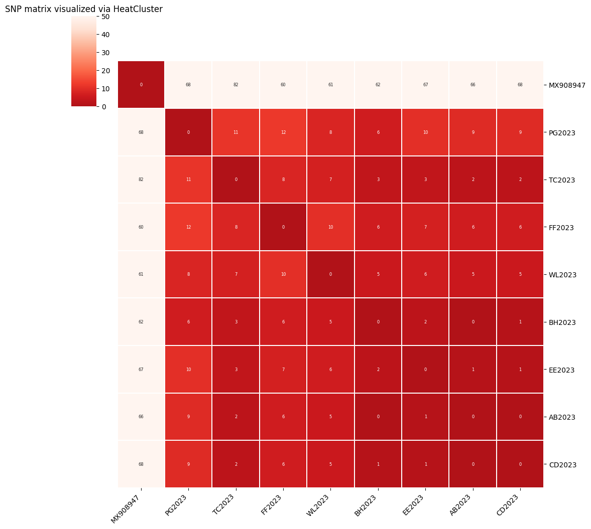
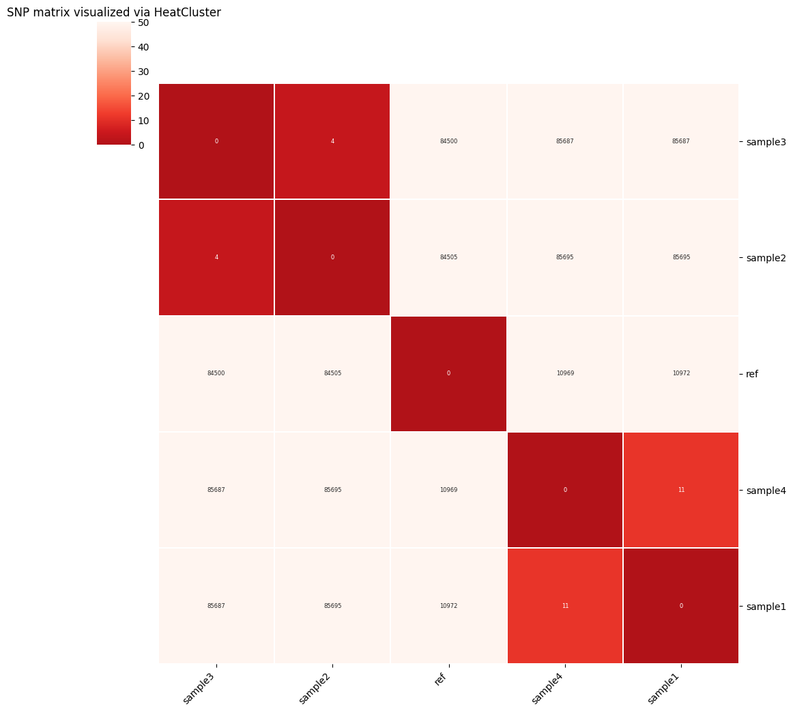

# HeatCluster SNP Matrix Visualization

Welcome to HeatCluster SNP Matrix Visualization, a Python tool for visualizing SNP (Single Nucleotide Polymorphism) matrices generated via [SNP-dists](https://github.com/tseemann/snp-dists) using heatmaps. 

## Introduction

HeatCluster SNP Matrix Visualization is designed to provide an easy and effective way to visualize SNP matrices. By generating heatmaps from these SNP matrices, it can be easier to identify clusters.

## Getting Started

Follow these steps to get started with HeatCluster SNP Matrix Visualization:

1. Clone the HeatCluster SNP Matrix Visualization repository to your local machine:

```bash
git clone https://github.com/DrB-S/HeatCluster.git
```

`HeatCluster.py` can be found in the HeatCluster directory that was just created.

## Running HeatCluster.py

```
usage: HeatCluster.py [-h] -i INPUT [-o OUT] [-t TYPE] [-v]

options:
  -h, --help                show this help message and exit
  -i INPUT, --input INPUT   input SNP matrix
  -o OUT, --out OUT         final file name (default = 'SNP_matrix')
  -t TYPE, --type TYPE      file extention for final image (default = 'pdf')
  -v, --version             print version and exit
```

Example:
```
./HeatCluster.py -i test/snp_matrix.txt -o test
```

This will generate a file called 'test.pdf'.

Examples:





